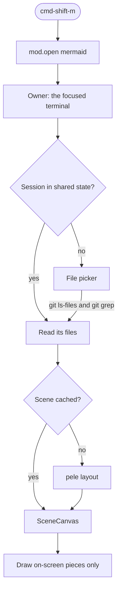
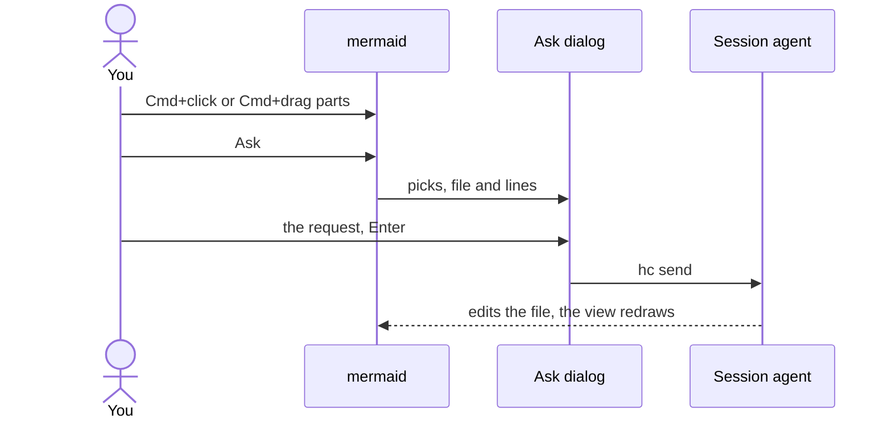

# mermaid

How the mermaid mod (`herdr-scene/mods/mermaid`, built from `herdr-scene`)
opens, draws and asks.

## Opening

```mermaid
flowchart TD
  key([cmd-shift-m]) --> open[mod.open mermaid]
  open --> owner[Owner: the focused terminal]
  owner --> saved{Session in shared state?}
  saved -->|yes| files[Read its files]
  saved -->|no| picker[File picker]
  picker -->|git ls-files and git grep| files
  files --> cached{Scene cached?}
  cached -->|yes| canvas[SceneCanvas]
  cached -->|no| layout[pele layout] --> canvas
  canvas --> pieces[Draw on-screen pieces only]
```

## Asking

```mermaid
sequenceDiagram
  actor You
  participant View as mermaid
  participant Dialog as Ask dialog
  participant Agent as Session agent
  You->>View: Cmd+click or Cmd+drag parts
  You->>View: Ask
  View->>Dialog: picks, file and lines
  You->>Dialog: the request, Enter
  Dialog->>Agent: hc send
  Agent-->>View: edits the file, the view redraws
```
